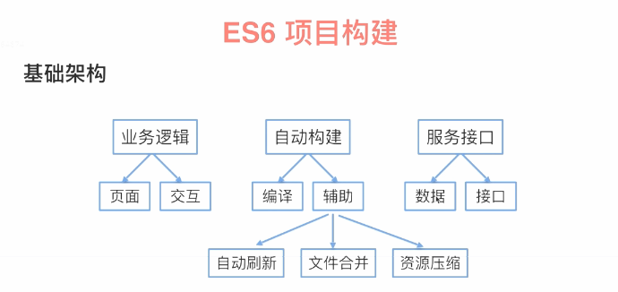

#### 项目结构
<pre>
├── app                       前端业务逻辑
  ├── css
  ├── js
    ├── class                 放置类文件
      ├── test.js             测试文件
      ├── index.js            入口文件
  ├── views
    ├── error.ejs             错误文件
    ├── index.js              入口文件
├── server                    后端服务接口

├── tasks                     构建工具
  ├──util                     
    ├── args.js               处理命令行参数
  ├── build                   把所有任务串起来
  ├── clean.js                清除指定文件命令
  ├── browser.js              浏览器监听
  ├── css.js                  构建脚本对css处理
  ├── pages.js                构建脚本对pages处理
  ├── scripts.js              构建脚本对js处理
  ├── server.js               构建脚本对服务器js处理
  ├── default.js              执行gulp时默认执行default.js
├── package.json              包管理文件
├── .babelrc                  babel编译配置文件
├── gulpfile.babel.js         这个名称是固定的，加babel是因为使用ES6语法写的
</pre>

### 项目构建
* 基础架构

* 任务自动化（Gulp）  

* 编译工具（babel、webpack）  

* 代码实现

#### 1. 项目架构

#### 2. 任务自动化（Gulp）
> Gulp通过stream流这种概念去操作文件，使级联操作会非常的快，Gulp就是用来解决自动化构建工具，增强我们工作流程这样一个工具，他背后是用nodejs去做开发的，提供了很多插件，去完成各项任务(task)，通过不同task的组合去完成更加复杂性的东西，让开过程中的一些操作都自动化处理。  

>例如：使用sass、less如何编译成浏览器识别的css，模块化等。
#### 3. 编译工具（babel、webpack）  
  > babel是专门用来编译ES6代码的，编译成ES5甚至ES3，因为IE8以下浏览器对ES5的一些处理还存在兼容性  

  >webpack来处理项目模块化、依赖的问题  
  webpack-stream是webpack对gulp的一个支持
#### 4. 代码实现
  > 创建ES6前端工程  
  完成目录结构 自动构建 服务器搭建

#### 安装gulp所依赖包
npm install gulp gulp-if gulp-concat webpack webpack-stream vinyl-named gulp-livereload gulp-plumber gulp-rename gulp-uglify gulp-util gulp-live-server gulp-sequence require-dir del --save-dev

#### 安装babel包
npm install babel-loader babel-core babel-preset-env babel-preset-es2015 --save-dev

#### 浏览器自动刷新
npm install connect-livereload --save-dev
